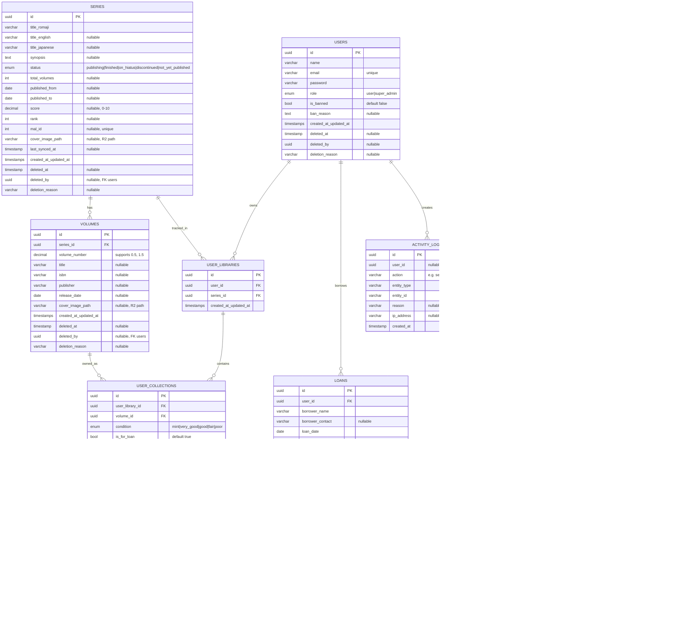

# Entity Relationship Diagram (ERD)

## Penjelasan Skema

Database MALAS menggunakan MySQL (MariaDB 10.4.32 via XAMPP) dengan dua kelompok entitas utama:

- **Kelompok Fisik**: `series`, `volumes`, `user_libraries`, `user_collections`, `loans`, `loan_items` — inti sistem koleksi dan peminjaman.
- **Kelompok Jikan**: `jikan_schedules`, `jikan_scrape_sessions` — manajemen scraping dari MyAnimeList API.
- **Kelompok Sistem**: `users`, `activity_logs`, `jobs`, `failed_jobs` — autentikasi, audit trail, dan queue.

Semua tabel utama menggunakan UUID sebagai primary key (via `HasUuids` trait) dan memiliki kolom `deleted_at`, `deleted_by`, `deletion_reason` untuk soft deletes dengan actor tracking (via `HasSoftDeletesWithActor`).

## Diagram ERD

## Daftar Tabel dan Fungsi

| Tabel | Fungsi |
|---|---|
| `users` | Data pengguna: nama, email, role (`user`/`super_admin`), status ban. UUID PK. |
| `series` | Entitas utama — metadata judul manga/manhwa. Penghubung antara volumes dan user_libraries. UUID PK, unique `mal_id`. |
| `volumes` | Buku fisik per series. Mendukung `volume_number` desimal. UUID PK. Cover disimpan di R2. |
| `user_libraries` | Tabel bridge `users` ↔ `series`. Dibuat saat user pertama kali memiliki/mendaftarkan koleksi dari series ini. |
| `user_collections` | Kepemilikan satu volume fisik oleh user (via `user_library_id`), beserta kondisi, harga beli, dan status pinjam. |
| `loans` | Header peminjaman satu sesi — ke siapa, kapan, due date, status. |
| `loan_items` | Baris detail peminjaman: volume mana yang masuk dalam loan ini. |
| `jikan_schedules` | Konfigurasi jadwal scraping otomatis: jam, menit, rentang tahun, urutan eksekusi. |
| `jikan_scrape_sessions` | Log satu sesi scraping — halaman saat ini, status, error, waktu mulai/selesai. |
| `activity_logs` | Audit trail: setiap aksi CRUD/delete oleh admin dicatat di sini. |
| `jobs` | Antrian pekerjaan background (queue driver: database). |
| `failed_jobs` | Pekerjaan background yang gagal setelah semua retry. |

## Catatan Penting

- `user_libraries` adalah entitas implisit: dibuat otomatis via `UserLibrary::firstOrCreate()` saat menambah koleksi.
- Cover image (series dan volume) disimpan sebagai path relatif di R2. URL publik: `https://pub-da18e323b0e64eadadb3ac8e6a28064b.r2.dev/{path}`.
- Tidak ada tabel `chapters`, `sources`, `user_tracking`, atau `loan_events` — fitur tracking digital belum diimplementasi.
