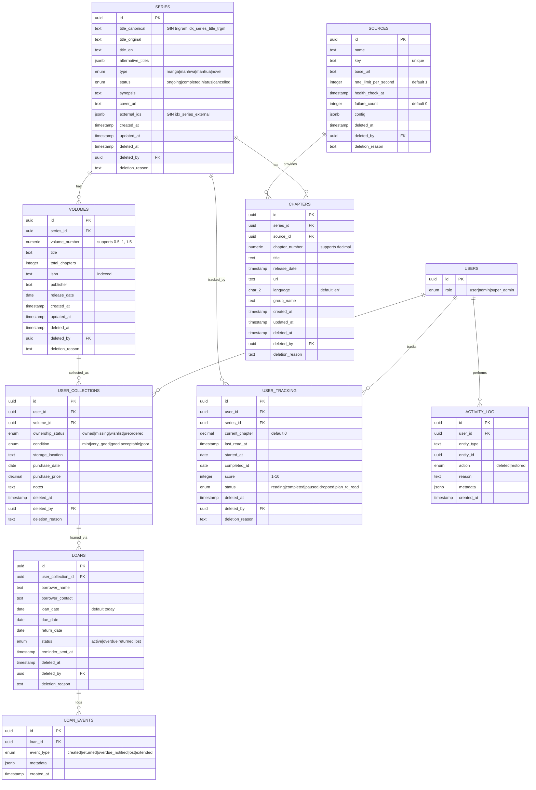

# Entity Relationship Diagram (ERD)

## Penjelasan Skema

Database MALAS terbagi menjadi dua kelompok entitas yang dihubungkan oleh `series`:

- **Kelompok Digital**: `chapters`, `sources`, `user_tracking` - mengelola progress bacaan dan sumber eksternal.
- **Kelompok Fisik**: `volumes`, `user_collections`, `loans`, `loan_events` - mengelola koleksi fisik dan peminjaman.
- **Kelompok Audit**: `activity_log` - mencatat semua aksi soft delete dan restore di seluruh tabel.

Semua tabel (kecuali `loan_events`) menggunakan UUID sebagai primary key dan memiliki kolom `deleted_at`, `deleted_by`, `deletion_reason` untuk SoftDeletes dengan actor tracking.

## Diagram ERD

## Daftar Tabel dan Fungsi

| Tabel | Fungsi |
|---|---|
| `series` | Entitas utama, menyimpan metadata judul manga/manhwa/manhua/novel. Penghubung antara lapisan Tracking dan Collection. |
| `volumes` | Representasi buku fisik per series, mendukung nomor volume desimal (mis. 0.5, 1.5). |
| `chapters` | Unit bacaan digital dari sumber eksternal, terkait ke `sources`. |
| `sources` | Registry sumber eksternal (mis. MangaDex), menyimpan konfigurasi, rate limit, status health check. |
| `user_collections` | Kepemilikan volume fisik oleh user (owned/missing/wishlist/preordered) beserta kondisi dan lokasi penyimpanan. |
| `loans` | Data peminjaman volume fisik ke pihak luar (nama peminjam, due date, status). |
| `loan_events` | Log event immutable (append-only) untuk riwayat peminjaman (created, returned, overdue_notified, lost, extended). |
| `user_tracking` | Progress bacaan digital user per series (chapter saat ini, status, skor). |
| `activity_log` | Audit trail untuk semua aksi soft delete dan restore di seluruh tabel. |
| `users` | Data pengguna, termasuk kolom `role` untuk pembagian akses (user/admin/super_admin). |

## Catatan Partial Unique Index

Partial unique index tidak dapat direpresentasikan langsung dalam Mermaid ERD, sehingga dicatat secara terpisah:

| Tabel | Partial Unique Index | Kondisi | Tujuan |
|---|---|---|---|
| `user_collections` | `(user_id, volume_id)` | `WHERE deleted_at IS NULL` | Satu user tidak boleh punya entri aktif duplikat untuk volume yang sama |
| `loans` | `(user_collection_id)` | `WHERE deleted_at IS NULL AND status IN ('active','overdue')` | Satu volume tidak boleh dipinjam dua orang sekaligus |
| `user_tracking` | `(user_id, series_id)` | `WHERE deleted_at IS NULL` | Satu user hanya boleh punya satu tracking aktif per series |
| `chapters` | `(series_id, source_id, chapter_number, language)` | unique constraint biasa (non-partial) | Mencegah duplikasi chapter dari sumber yang sama |

**Catatan khusus**: `loan_events` adalah tabel append-only (immutable). Tidak memiliki `deleted_at`, `deleted_by`, atau `deletion_reason`. Tidak ada operasi UPDATE atau DELETE yang diperbolehkan pada tabel ini.
