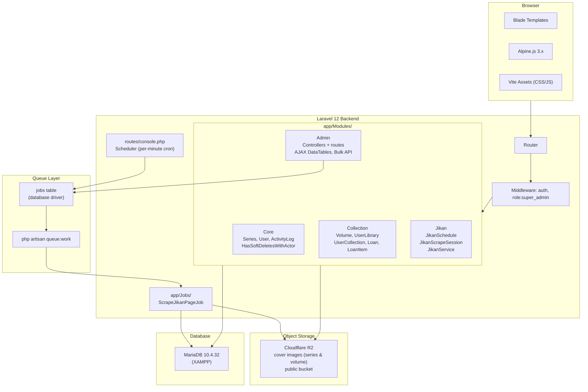

# Arsitektur Sistem

## Stack Teknologi

| Layer | Teknologi |
|---|---|
| **Backend** | Laravel 12, PHP 8.x |
| **Database** | MySQL / MariaDB 10.4.32 (XAMPP lokal) |
| **Queue Driver** | Database (`QUEUE_CONNECTION=database`) |
| **Object Storage** | Cloudflare R2 (`FILESYSTEM_DISK=r2`) |
| **Frontend** | Blade + Alpine.js 3.x + Tailwind CSS + Flowbite |
| **Build Tool** | Vite + Laravel Plugin |
| **UI Components** | TomSelect (autocomplete), SortableJS (drag-drop), DataTables.net (custom AJAX) |
| **Font** | Inter (Google Fonts) |
| **Autentikasi** | Laravel session + middleware `auth` + `role:super_admin` |

## Diagram Arsitektur



## Struktur Modul

### Core
Fondasi yang dipakai modul lain. Berisi:
- `Series` — entitas utama (UUID PK, soft deletes with actor, `mal_id` unique)
- `User` — autentikasi + role (`user`/`super_admin`) + ban/unban
- `ActivityLog` — audit trail semua aksi admin
- `HasSoftDeletesWithActor` — trait yang menambah `deleted_by`, `deletion_reason`, dan auto-log ke `activity_logs`

### Collection
Manajemen koleksi fisik:
- `Volume` — buku fisik per series (cover di R2)
- `UserLibrary` — bridge `users` ↔ `series` (auto-created via `firstOrCreate`)
- `UserCollection` — kepemilikan volume (kondisi, harga, flag pinjam)
- `Loan` + `LoanItem` — peminjaman volume ke pihak luar

### Admin
Seluruh panel admin. Tidak ada Filament — murni custom MVC:
- Controller per resource: Series, Volume, Collection, Loan, User, Jikan, ActivityLog
- `AdminApiController` — endpoint AJAX internal (series search, volumes per series)
- Route prefix `admin/`, protected `auth` + `role:super_admin`
- AJAX DataTable pattern: controller detect `$request->ajax()` → return JSON

### Jikan
Scraping data dari Jikan API (wrapper MyAnimeList):
- `JikanSchedule` — konfigurasi jadwal (jam, menit, rentang tahun, sort_order)
- `JikanScrapeSession` — log satu sesi (status: pending → queued → running → completed/failed)
- `JikanService` — HTTP calls ke Jikan API dengan year filter
- `ScrapeJikanPageJob` — job queue yang memproses satu halaman; dispatch next-queued setelah selesai
- `routes/console.php` — loop semua schedules setiap menit, buat session jika jadwal cocok

## Alur Data: Tambah Koleksi Bulk

```
Browser (Alpine.js)
  → POST /admin/api/series/search?q=...   (TomSelect autocomplete)
  → GET  /admin/api/series/{id}/volumes?user_id=...  (load volumes per entry)
  → POST /admin/collections/bulk  (JSON: user_id + entries[])
      → CollectionController::bulkStore()
          → UserLibrary::firstOrCreate()
          → UserCollection::create() per volume
          → return JSON {message, count}
  → redirect ke collections.index setelah 1.2 detik
```

## Alur Data: Scraping Jikan

```
routes/console.php (tiap menit)
  → loop JikanSchedule aktif
  → jika hour:minute cocok:
      → jika ada session running/queued → buat session 'queued'
      → otherwise → buat session 'pending', dispatch ScrapeJikanPageJob

ScrapeJikanPageJob (queue worker)
  → GET jikan.moe/v4/manga?page=N&order_by=...&start_date=...
  → upsert ke tabel series berdasarkan mal_id
  → jika ada halaman berikutnya → dispatch job halaman N+1
  → jika selesai → dispatchNextQueued() berdasarkan sort_order jikan_schedules
```

## Catatan Penting

- **Tidak ada Redis** — queue pakai driver `database`, bukan Redis/Horizon.
- **Tidak ada Filament** — admin panel custom (Blade + Alpine.js).
- **R2 sebagai default disk** — semua `Storage::disk()` (tanpa arg) mengarah ke R2 via `FILESYSTEM_DISK=r2`.
- **Asset build**: `npm run build` → output ke `public/build/`. Tidak perlu hot reload di production.
