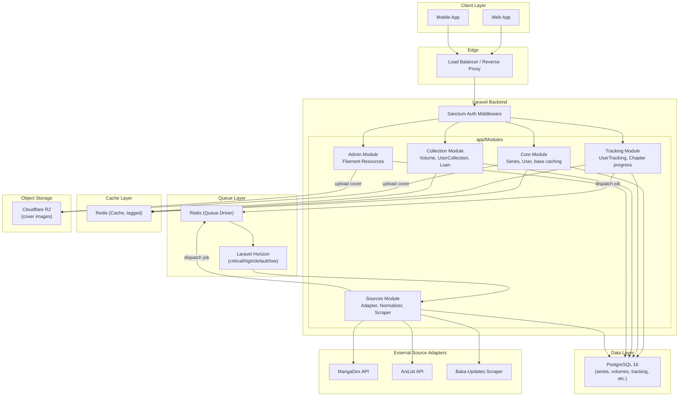

# Arsitektur Sistem

## Dua Lapisan Logika

MALAS dibangun di atas dua lapisan logika utama yang terhubung melalui entitas `Series`:

1. **Lapisan Tracking** (digital): mengelola progress baca user terhadap chapter, termasuk status (reading/completed/dll), skor, dan waktu terakhir baca. Modul ini berinteraksi dengan tabel `chapters` dan `user_tracking`.

2. **Lapisan Collection** (fisik): mengelola kepemilikan fisik volume, kondisi barang, lokasi penyimpanan, dan sistem peminjaman antar pengguna. Modul ini berinteraksi dengan tabel `volumes`, `user_collections`, `loans`, dan `loan_events`.

Kedua lapisan ini **tidak boleh saling mencampur logika bisnis** dalam satu service. Mereka hanya bertemu melalui referensi `series_id` yang sama.

## Diagram Arsitektur

## Alur Data: Client ke Database

1. **Request masuk** dari Web atau Mobile App menuju Load Balancer / Reverse Proxy.
2. **Autentikasi** dilakukan oleh middleware Sanctum. Untuk endpoint publik (`GET /api/series`, dll), middleware ini dilewati dan diganti dengan rate limiting per IP.
3. **Routing ke modul**: request diteruskan ke controller di modul terkait (Core, Tracking, Collection, atau Admin) berdasarkan endpoint.
4. **Cache check**: untuk request read-heavy (series detail, chapters list, user dashboard), service terlebih dahulu memeriksa Redis cache bertag sebelum query ke PostgreSQL.
5. **Query ke PostgreSQL**: jika cache miss, service melakukan query melalui Repository, lalu menyimpan hasil ke cache dengan TTL sesuai jenis data (series 1 jam, chapters 6 jam, dashboard 15 menit).
6. **Operasi async**: operasi yang melibatkan sumber eksternal (fetch chapter, health check, deduplikasi) tidak dieksekusi langsung, melainkan di-dispatch sebagai job ke Redis queue dan diproses oleh Horizon worker sesuai prioritas (critical/high/default/low).
7. **Source Adapter**: worker memanggil adapter sumber eksternal (MangaDex, AniList, dll) sesuai `SourceAdapterInterface`, menormalisasi response, lalu menyimpan ke PostgreSQL.
8. **Object storage**: upload cover image (oleh user/admin via Core atau Admin module) disimpan langsung ke Cloudflare R2, bukan local storage. Hanya URL yang disimpan di kolom `cover_url`.
9. **Response**: hasil dikembalikan ke client dalam format JSON konsisten (`success`, `data`, `message`, `errors`).