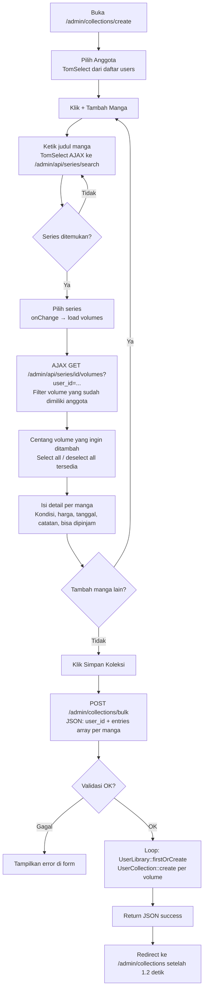
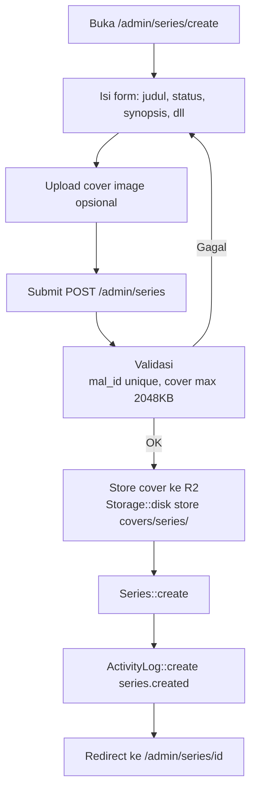
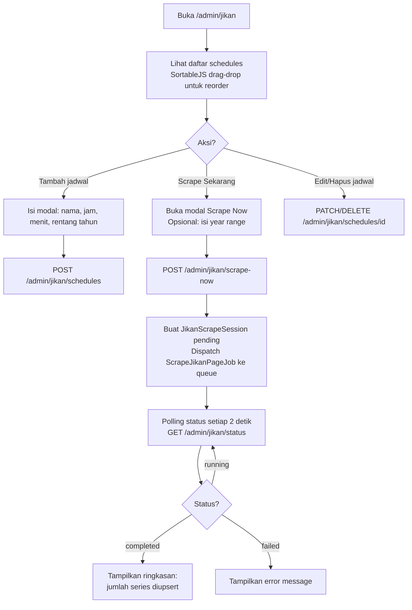
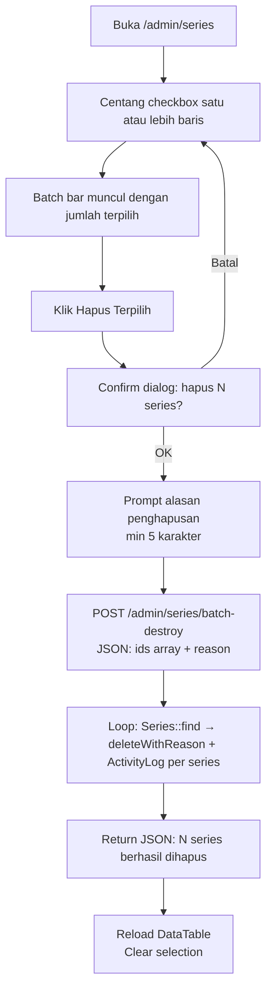
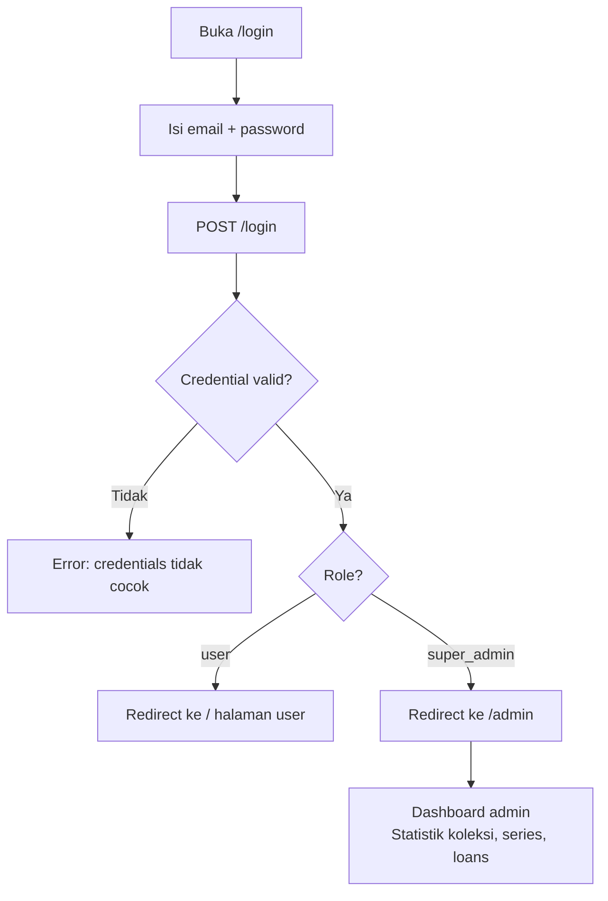
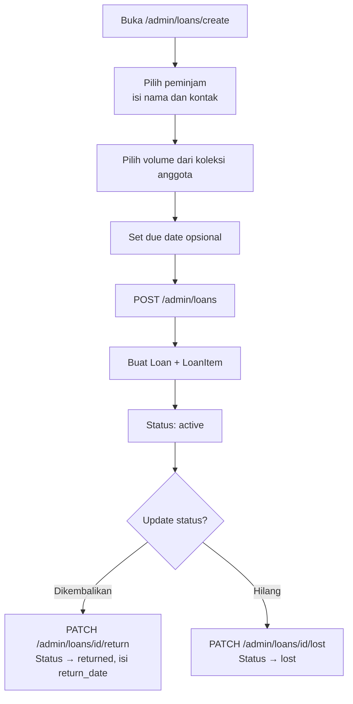

# User Flow Diagrams

Dokumen ini berisi flow utama dalam aplikasi MALAS (saat ini semua operasi via panel admin `super_admin`).

## Flow A: Admin Tambah Koleksi Bulk

## Flow B: Admin Menambah Series Manual

## Flow C: Admin Jikan Scraping

## Flow D: Admin Batch Delete Series

## Flow E: Login Super Admin

## Flow F: Admin Peminjaman Volume

