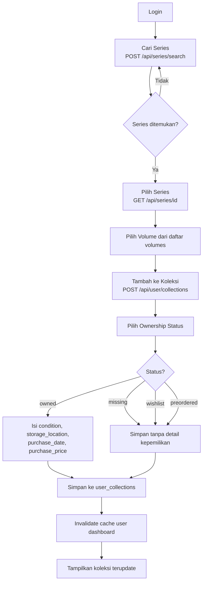
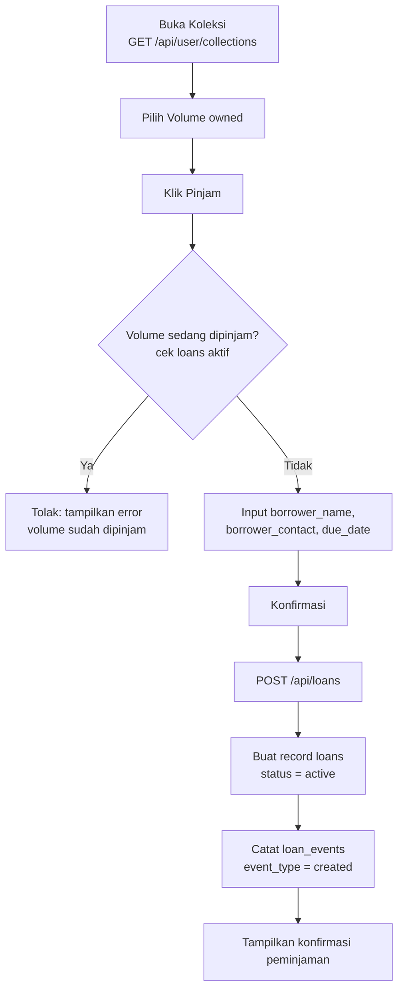
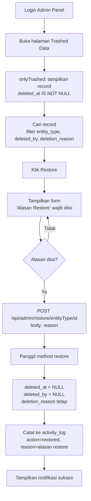
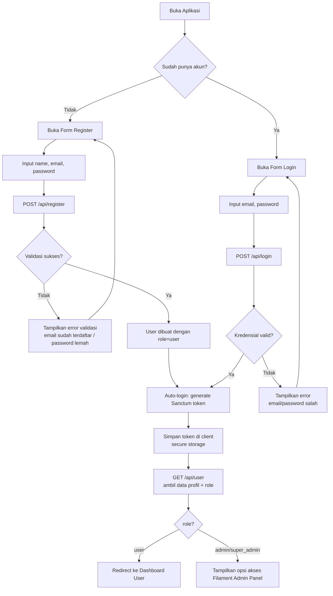

# User Flow Diagrams

Dokumen ini berisi 4 flow utama dalam aplikasi MALAS: penambahan koleksi fisik, peminjaman volume, restore data oleh admin, dan login/register.

## Flow A: User Menambah Koleksi Fisik

## Flow B: User Meminjamkan Volume

## Flow C: Admin Restore Data

## Flow D: User Login & Register

