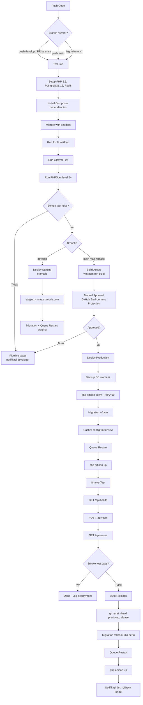

# CI/CD Pipeline

## Diagram Pipeline

## Penjelasan Setiap Stage

### 1. Test
Dijalankan setiap push ke `develop`/`main` atau saat ada Pull Request ke `main`. Stage ini menyiapkan environment lengkap (PHP 8.3, PostgreSQL 16, Redis), menjalankan migration dengan seeder, lalu mengeksekusi:
- **PHPUnit/Pest**: unit test (DeduplicationService, SourceNormalizer, LoanOverdueChecker) dan feature test (API endpoints).
- **Laravel Pint**: pengecekan code style.
- **PHPStan level 5+**: static analysis untuk menangkap bug potensial sebelum runtime.

Jika salah satu gagal, pipeline berhenti dan developer dinotifikasi.

### 2. Build
Dijalankan saat push ke `main`. Mengompilasi asset frontend (`vite`/`npm run build`) dan menyiapkan artifact untuk deployment.

### 3. Deploy Staging
Dijalankan otomatis saat push ke `develop` dan semua test lulus. Deploy ke `staging.malas.example.com` menggunakan database staging terpisah (bisa di-restore dari backup production mingguan) dan Redis terpisah untuk queue.

### 4. Manual Approve
Khusus untuk deploy ke production (branch `main` atau tag release `v*`), wajib ada persetujuan manual minimal 1 orang melalui GitHub Actions "environment protection rule". Tanpa approval, pipeline berhenti di sini.

### 5. Deploy Production
Setelah disetujui, dilakukan:
1. Backup database otomatis sebelum migrasi.
2. Maintenance mode (`php artisan down --retry=60`).
3. Migration (`php artisan migrate --force`).
4. Cache ulang config, route, dan view.
5. Restart queue worker (`php artisan queue:restart`).
6. Matikan maintenance mode (`php artisan up`).

Production menggunakan strategi **zero-downtime** (blue-green dengan load balancer, atau Laravel Envoy dengan symlink release).

### 6. Smoke Test
Dijalankan otomatis setelah deploy production selesai, menguji minimal 3 endpoint kritis:
- `GET /api/health` → harus 200 OK
- `POST /api/login` → harus 200 + token
- `GET /api/series` → harus 200 + JSON

### 7. Rollback
Jika smoke test gagal, sistem otomatis melakukan rollback:
- `git reset --hard [previous_release_hash]`
- Migration rollback jika diperlukan (`php artisan migrate:rollback --step=1`)
- Restart queue
- Matikan maintenance mode

Target waktu rollback: maksimal 10 menit. Tim dinotifikasi setiap kali rollback terjadi.

## Estimasi Waktu Maksimal per Skenario

| Skenario | Action | Waktu Maksimal |
|---|---|---|
| Migration gagal | `php artisan migrate:rollback --step=1` | 5 menit |
| Queue job gagal massal | Deploy ulang versi sebelumnya + restart queue | 10 menit |
| API error rate > 5% | Auto rollback ke release sebelumnya | 15 menit |