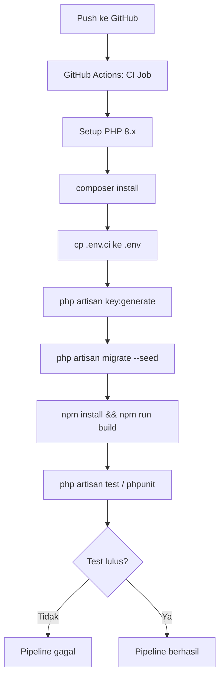
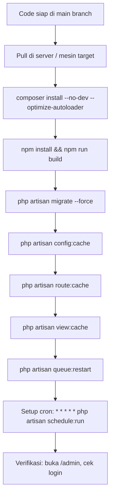

# CI/CD Pipeline

## Catatan Status

Saat ini MALAS berjalan di lingkungan **development lokal** (XAMPP, Windows). Pipeline CI/CD belum aktif digunakan secara production. Dokumen ini mendeskripsikan setup yang ada dan prosedur deployment manual.

## Setup Lokal (Development)

```
Stack lokal:
- PHP via XAMPP (MariaDB 10.4.32, Apache/PHP)
- Composer untuk PHP dependencies
- Node.js + npm untuk frontend assets
- php artisan serve atau via XAMPP Apache

Commands:
  composer install
  cp src/.env.example src/.env
  php artisan key:generate
  php artisan migrate
  npm install
  npm run dev          # Vite dev server dengan HMR
  php artisan queue:work   # Jalankan queue worker
  php artisan schedule:run # Jalankan scheduler (atau setup cron)
```

## Workflow CI (GitHub Actions)

File CI: `.github/workflows/` (jika ada).



## Deployment Manual

Karena tidak ada server production aktif, deployment dilakukan manual:



## Environment Variables Wajib

Lihat [env-setup.md](./env-setup.md) untuk daftar lengkap. Variabel kritis:

| Variable | Keterangan |
|---|---|
| `APP_KEY` | Generate via `php artisan key:generate` |
| `DB_*` | Koneksi MariaDB |
| `FILESYSTEM_DISK=r2` | Default disk ke Cloudflare R2 |
| `AWS_ACCESS_KEY_ID` | R2 Access Key ID |
| `AWS_SECRET_ACCESS_KEY` | R2 Secret Access Key |
| `AWS_ENDPOINT` | R2 endpoint URL |
| `FILESYSTEM_URL` | R2 public URL untuk generate public links |
| `QUEUE_CONNECTION=database` | Queue via database, bukan Redis |

## Checklist Sebelum Deploy

- [ ] `.env` sudah dikonfigurasi (terutama DB dan R2 credentials)
- [ ] `php artisan migrate` berjalan tanpa error
- [ ] `npm run build` menghasilkan asset di `public/build/`
- [ ] `php artisan config:cache` + `route:cache` bersih (tanpa error)
- [ ] Queue worker berjalan: `php artisan queue:work --daemon`
- [ ] Cron scheduler aktif: `* * * * * cd /path/to/project && php artisan schedule:run`
- [ ] Login admin berfungsi: `/login` → `/admin`
- [ ] Upload cover series berfungsi (verifikasi file muncul di R2)
