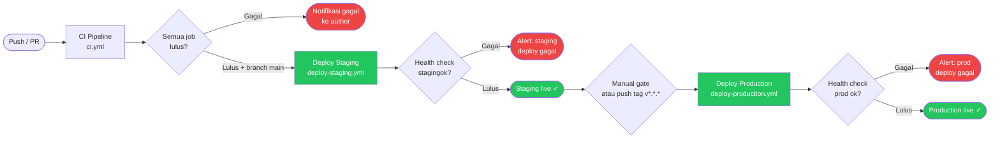

# CI/CD Pipeline — MALAS (Manga Library Admin System)

**Versi:** 1.0  
**Tanggal:** 2026-06-14

---

## 1. Diagram Pipeline



**Alur ringkas:**
1. Setiap push/PR ke semua branch → CI (lint, test, security, build)
2. Push ke `main` (setelah CI lulus) → auto-deploy ke staging
3. Push tag `v*.*.*` atau trigger manual → deploy ke production

---

## 2. Required GitHub Secrets

Konfigurasi di **Settings → Secrets and variables → Actions**:

### Staging
| Secret | Contoh | Keterangan |
|--------|--------|------------|
| `STAGING_HOST` | `123.456.789.0` | IP atau domain staging server |
| `STAGING_USER` | `deploy` | SSH user |
| `STAGING_PATH` | `/var/www/malas-staging` | Path project di server |
| `STAGING_URL` | `https://staging.malas.example.com` | URL untuk health check |

### Production
| Secret | Contoh | Keterangan |
|--------|--------|------------|
| `PRODUCTION_HOST` | `123.456.789.1` | IP atau domain production server |
| `PRODUCTION_USER` | `deploy` | SSH user |
| `PRODUCTION_PATH` | `/var/www/malas` | Path project di server |
| `PRODUCTION_URL` | `https://malas.example.com` | URL untuk health check |

### SSH
| Secret | Keterangan |
|--------|------------|
| `SSH_PRIVATE_KEY` | Private key untuk SSH ke staging & production |

### App
| Secret | Keterangan |
|--------|------------|
| `APP_KEY_STAGING` | Laravel APP_KEY untuk staging |
| `APP_KEY_PRODUCTION` | Laravel APP_KEY untuk production |
| `DB_PASSWORD_STAGING` | Password DB staging |
| `DB_PASSWORD_PRODUCTION` | Password DB production |
| `AWS_ACCESS_KEY_ID` | R2 Access Key ID |
| `AWS_SECRET_ACCESS_KEY` | R2 Secret Access Key |

---

## 3. Environment `.env.testing`

Dipakai di CI runner untuk test:

```env
APP_NAME="MALAS Test"
APP_ENV=testing
APP_KEY=base64:testkeyfortesting==
APP_DEBUG=true
APP_URL=http://localhost

LOG_CHANNEL=stderr

DB_CONNECTION=mysql
DB_HOST=127.0.0.1
DB_PORT=3306
DB_DATABASE=malas_test
DB_USERNAME=root
DB_PASSWORD=

CACHE_STORE=array
SESSION_DRIVER=array
QUEUE_CONNECTION=sync

FILESYSTEM_DISK=local
AWS_ACCESS_KEY_ID=fake
AWS_SECRET_ACCESS_KEY=fake
AWS_DEFAULT_REGION=auto
AWS_BUCKET=test-bucket
AWS_ENDPOINT=http://localhost

MAIL_MAILER=array

FILAMENT_FILESYSTEM_DISK=local
```

---

## 4. Server Setup Checklist

Checklist untuk VPS Ubuntu 22.04 baru:

### 4.1 System Setup

```bash
# Update system
apt update && apt upgrade -y

# Install dependencies
apt install -y curl git unzip zip nginx supervisor certbot python3-certbot-nginx

# Add PHP 8.3 repo
add-apt-repository ppa:ondrej/php -y
apt update

# Install PHP 8.3 + extensions
apt install -y php8.3-fpm php8.3-cli php8.3-mysql php8.3-mbstring \
    php8.3-xml php8.3-curl php8.3-gd php8.3-intl php8.3-zip \
    php8.3-bcmath php8.3-redis php8.3-imagick

# Install MySQL 8
apt install -y mysql-server
mysql_secure_installation

# Install Composer
curl -sS https://getcomposer.org/installer | php
mv composer.phar /usr/local/bin/composer

# Install Node.js 20
curl -fsSL https://deb.nodesource.com/setup_20.x | bash -
apt install -y nodejs
```

### 4.2 Deploy User

```bash
# Buat user deploy (non-root)
adduser deploy
usermod -aG www-data deploy

# Setup SSH key untuk deploy user
su - deploy
mkdir ~/.ssh && chmod 700 ~/.ssh
# Paste public key yang sesuai dengan SSH_PRIVATE_KEY secret
echo "ssh-rsa AAAA..." >> ~/.ssh/authorized_keys
chmod 600 ~/.ssh/authorized_keys
```

### 4.3 MySQL Setup

```bash
mysql -u root -p
CREATE DATABASE malas CHARACTER SET utf8mb4 COLLATE utf8mb4_unicode_ci;
CREATE USER 'malas'@'localhost' IDENTIFIED BY 'password_kuat_disini';
GRANT ALL PRIVILEGES ON malas.* TO 'malas'@'localhost';
FLUSH PRIVILEGES;
EXIT;
```

### 4.4 Nginx Config

Simpan sebagai `/etc/nginx/sites-available/malas`:

```nginx
server {
    listen 80;
    server_name malas.example.com;
    root /var/www/malas/public;

    add_header X-Frame-Options "SAMEORIGIN";
    add_header X-Content-Type-Options "nosniff";

    index index.php;

    charset utf-8;

    location / {
        try_files $uri $uri/ /index.php?$query_string;
    }

    location = /favicon.ico { access_log off; log_not_found off; }
    location = /robots.txt  { access_log off; log_not_found off; }

    error_page 404 /index.php;

    location ~ \.php$ {
        fastcgi_pass unix:/var/run/php/php8.3-fpm.sock;
        fastcgi_param SCRIPT_FILENAME $realpath_root$fastcgi_script_name;
        include fastcgi_params;
        fastcgi_hide_header X-Powered-By;
    }

    location ~ /\.(?!well-known).* {
        deny all;
    }

    client_max_body_size 20M;
}
```

```bash
ln -s /etc/nginx/sites-available/malas /etc/nginx/sites-enabled/
nginx -t && systemctl reload nginx

# SSL
certbot --nginx -d malas.example.com
```

### 4.5 Supervisor Config

Simpan sebagai `/etc/supervisor/conf.d/malas-worker.conf`:

```ini
[program:malas-worker]
process_name=%(program_name)s_%(process_num)02d
command=php /var/www/malas/artisan queue:work database --sleep=3 --tries=3 --max-time=3600
autostart=true
autorestart=true
stopasgroup=true
killasgroup=true
user=deploy
numprocs=1
redirect_stderr=true
stdout_logfile=/var/www/malas/storage/logs/worker.log
stopwaitsecs=3600
```

```bash
supervisorctl reread
supervisorctl update
supervisorctl start malas-worker:*
```

### 4.6 Cron (Laravel Scheduler)

```bash
crontab -e -u deploy
# Tambahkan:
* * * * * cd /var/www/malas && php artisan schedule:run >> /dev/null 2>&1
```

---

## 5. Post-Deploy Checklist

Dijalankan otomatis oleh workflow, tapi berguna untuk manual deploy:

```bash
cd /var/www/malas

git pull origin main
composer install --no-dev --optimize-autoloader
npm ci && npm run build

php artisan migrate --force
php artisan config:cache
php artisan route:cache
php artisan view:cache
php artisan icons:cache      # Filament icons
php artisan filament:cache-components
php artisan optimize

php artisan queue:restart
supervisorctl restart malas-worker:*

# Verifikasi
curl -f https://malas.example.com/up || echo "HEALTH CHECK FAILED"
```
