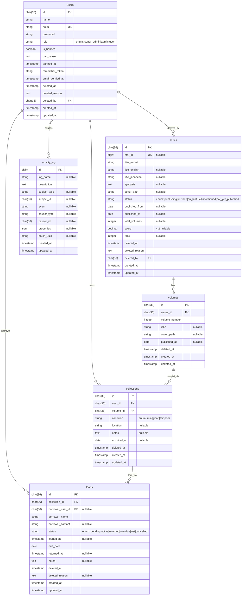

# ERD — Entity Relationship Diagram
# MALAS (Manga Library Admin System)

**Versi:** 1.0  
**Tanggal:** 2026-06-14

---

## 1. Diagram ERD (Mermaid)



---

## 2. Deskripsi Entitas

### `users`

Menyimpan semua user sistem — `super_admin`, `admin`, dan `user` (borrower).

| Kolom | Tipe | Constraint | Keterangan |
|-------|------|-----------|------------|
| `id` | `char(36)` | PK | UUID v7 |
| `name` | `varchar(255)` | NOT NULL | Nama tampil |
| `email` | `varchar(255)` | UNIQUE, NOT NULL | Login identifier |
| `password` | `varchar(255)` | NOT NULL | bcrypt hash |
| `role` | `enum` | NOT NULL, default `user` | `super_admin`, `admin`, `user` |
| `is_banned` | `boolean` | NOT NULL, default false | Status ban |
| `ban_reason` | `text` | nullable | Alasan ban |
| `banned_at` | `timestamp` | nullable | Waktu ban |
| `deleted_at` | `timestamp` | nullable | Soft delete |
| `deleted_reason` | `text` | nullable | Alasan delete |
| `deleted_by` | `char(36)` | FK nullable | Siapa yang menghapus |

### `series`

Data manga series — bisa diinput manual atau diimport dari Jikan/MAL.

| Kolom | Tipe | Constraint | Keterangan |
|-------|------|-----------|------------|
| `id` | `char(36)` | PK | UUID v7 |
| `mal_id` | `bigint unsigned` | UNIQUE nullable | ID dari MyAnimeList |
| `title_romaji` | `varchar(255)` | NOT NULL | Judul utama (romaji) |
| `title_english` | `varchar(255)` | nullable | Judul English |
| `title_japanese` | `varchar(255)` | nullable | Judul Japanese |
| `synopsis` | `text` | nullable | Sinopsis |
| `cover_path` | `varchar(255)` | nullable | Path di R2 |
| `status` | `enum` | NOT NULL | Status terbit |
| `published_from` | `date` | nullable | Tanggal mulai terbit |
| `published_to` | `date` | nullable | Tanggal selesai terbit |
| `total_volumes` | `int unsigned` | nullable | Total volume (dari MAL) |
| `score` | `decimal(4,2)` | nullable | Skor MAL (0.00–10.00) |
| `rank` | `int unsigned` | nullable | Rank MAL |
| `deleted_at` | `timestamp` | nullable | Soft delete |
| `deleted_reason` | `text` | nullable | Alasan delete |
| `deleted_by` | `char(36)` | FK nullable | Siapa yang menghapus |

### `volumes`

Volume fisik dari suatu series. Setiap volume merepresentasikan satu buku fisik.

| Kolom | Tipe | Constraint | Keterangan |
|-------|------|-----------|------------|
| `id` | `char(36)` | PK | UUID v7 |
| `series_id` | `char(36)` | FK NOT NULL | Relasi ke `series` |
| `volume_number` | `int unsigned` | NOT NULL | Nomor volume (1, 2, 3...) |
| `isbn` | `varchar(20)` | nullable | ISBN-13 |
| `cover_path` | `varchar(255)` | nullable | Cover spesifik volume di R2 |
| `published_at` | `date` | nullable | Tanggal terbit volume ini |
| `deleted_at` | `timestamp` | nullable | Soft delete |

Unique constraint: `(series_id, volume_number)`.

### `collections`

Record kepemilikan: user X memiliki volume Y. Ini adalah entitas pivot dengan data tambahan (kondisi, lokasi).

| Kolom | Tipe | Constraint | Keterangan |
|-------|------|-----------|------------|
| `id` | `char(36)` | PK | UUID v7 |
| `user_id` | `char(36)` | FK NOT NULL | Pemilik |
| `volume_id` | `char(36)` | FK NOT NULL | Volume yang dimiliki |
| `condition` | `enum` | NOT NULL | `mint`, `good`, `fair`, `poor` |
| `location` | `varchar(255)` | nullable | Lokasi rak (misal: "Rak A, Baris 2") |
| `notes` | `text` | nullable | Catatan tambahan |
| `acquired_at` | `date` | nullable | Tanggal beli/dapat |
| `deleted_at` | `timestamp` | nullable | Soft delete |

Unique constraint: `(user_id, volume_id)` — satu user hanya bisa punya satu record per volume.

### `loans`

Transaksi peminjaman volume dari koleksi seseorang ke orang lain.

| Kolom | Tipe | Constraint | Keterangan |
|-------|------|-----------|------------|
| `id` | `char(36)` | PK | UUID v7 |
| `collection_id` | `char(36)` | FK NOT NULL | Koleksi yang dipinjam |
| `borrower_user_id` | `char(36)` | FK nullable | User peminjam (jika terdaftar) |
| `borrower_name` | `varchar(255)` | NOT NULL | Nama peminjam (wajib, untuk non-user) |
| `borrower_contact` | `varchar(255)` | nullable | Kontak peminjam |
| `status` | `enum` | NOT NULL, default `pending` | State machine status |
| `loaned_at` | `timestamp` | nullable | Waktu pinjam resmi dimulai |
| `due_date` | `date` | NOT NULL | Batas waktu pengembalian |
| `returned_at` | `timestamp` | nullable | Waktu dikembalikan |
| `notes` | `text` | nullable | Catatan peminjaman |
| `deleted_at` | `timestamp` | nullable | Soft delete |
| `deleted_reason` | `text` | nullable | Alasan delete |

### `activity_log`

Dikelola otomatis oleh `spatie/laravel-activitylog`. Tidak ada soft delete — ini adalah audit trail permanen.

---

## 3. Deskripsi Relasi

| Relasi | Tipe | Keterangan |
|--------|------|------------|
| `series` → `volumes` | 1:N | Satu series punya banyak volume |
| `users` → `collections` | 1:N | Satu user bisa punya banyak koleksi volume |
| `volumes` → `collections` | 1:N | Satu volume bisa masuk koleksi banyak user (tapi satu user hanya sekali) |
| `collections` → `loans` | 1:N | Satu koleksi bisa punya banyak loan (historis), tapi hanya 1 yang active/pending |
| `users` → `loans` (borrower) | 1:N | Satu user bisa meminjam banyak hal |
| `users` → `series/users` (deleted_by) | 1:N | FK soft untuk audit siapa yang menghapus |

---

## 4. Indexing Plan

| Tabel | Index | Tipe | Alasan |
|-------|-------|------|--------|
| `series` | `mal_id` | UNIQUE (partial, WHERE mal_id IS NOT NULL) | Lookup & constraint import Jikan |
| `series` | `title_romaji` | FULLTEXT | Search by judul di Filament |
| `series` | `status` | INDEX | Filter by status |
| `volumes` | `(series_id, volume_number)` | UNIQUE | Constraint nomor volume per series |
| `volumes` | `series_id` | INDEX | Eager load volumes per series |
| `collections` | `(user_id, volume_id)` | UNIQUE | Constraint kepemilikan |
| `collections` | `user_id` | INDEX | Lihat koleksi per user |
| `collections` | `volume_id` | INDEX | Cek siapa yang punya volume ini |
| `loans` | `collection_id` | INDEX | Cek loan per koleksi |
| `loans` | `status` | INDEX | Filter active/overdue loans |
| `loans` | `due_date` | INDEX | Scheduler overdue check |
| `loans` | `borrower_user_id` | INDEX | Riwayat pinjaman per user |
| `activity_log` | `(subject_type, subject_id)` | INDEX | Lookup log per model |
| `activity_log` | `(causer_type, causer_id)` | INDEX | Lookup log per user |

---

## 5. Soft Delete Strategy

Semua model utama menggunakan pola extended soft delete:

```
deleted_at       → timestamp standar Laravel SoftDeletes
deleted_reason   → TEXT, wajib diisi via form Filament saat delete
deleted_by       → UUID FK ke users.id, diisi otomatis via Model Observer
```

**Implementasi via Observer:**

```php
// app/Observers/SoftDeleteObserver.php
public function deleting(Model $model): void
{
    if (auth()->check()) {
        $model->deleted_by = auth()->id();
    }
}
```

**Implikasi query:** Semua query Eloquent default exclude soft-deleted. Gunakan:
- `withTrashed()` — include yang dihapus
- `onlyTrashed()` — hanya yang dihapus
- Filament filter "Termasuk yang dihapus" menggunakan `withTrashed()`

---

## 6. UUID Strategy

**Pilihan:** UUID v7 via Laravel `HasUuids` trait (Laravel 11+).

UUID v7 adalah time-ordered UUID — 48-bit timestamp prefix diikuti random bits. Ini berarti:
- **Performa index:** B-tree index lebih efisien karena UUID v7 monotonically increasing (seperti auto-increment, tapi tidak sequential)
- **Security:** Tidak ada ID yang bisa ditebak (berbeda dengan integer `1, 2, 3...`)
- **Distributed-safe:** Bisa di-generate di mana saja tanpa collision

**Implementasi:**

```php
use Illuminate\Database\Eloquent\Concerns\HasUuids;

class Series extends Model
{
    use HasUuids;
    // Laravel otomatis generate UUID v7 untuk kolom 'id'
}
```

**Tipe kolom di migration:** `$table->uuid('id')->primary();`

**FK kolom:** `$table->foreignUuid('series_id')->constrained()->cascadeOnDelete();`
