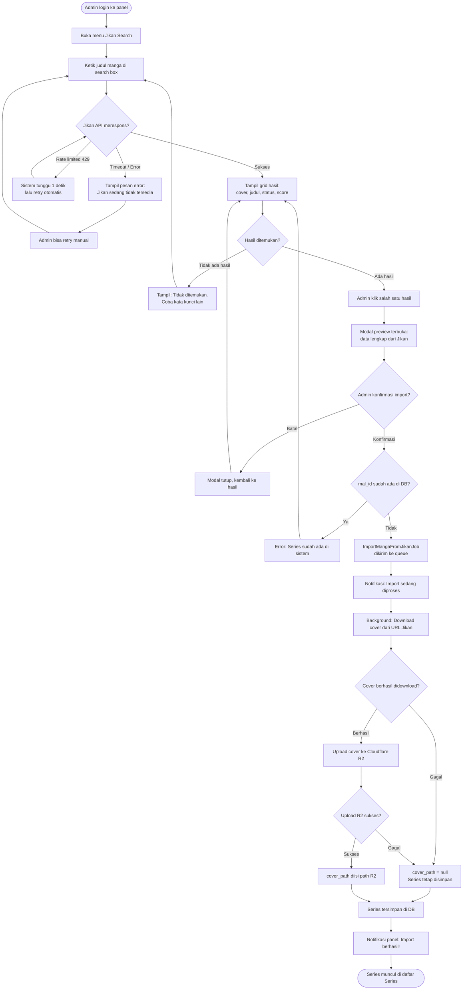
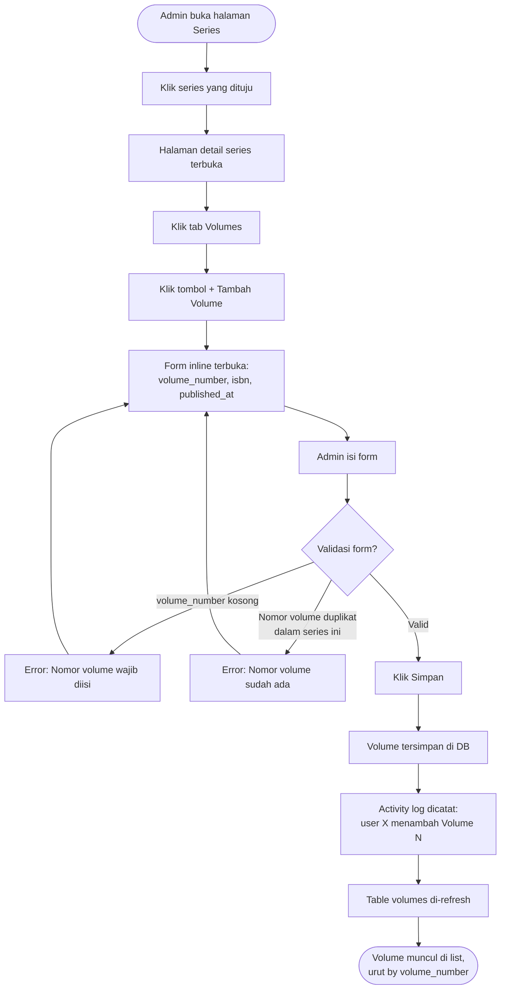
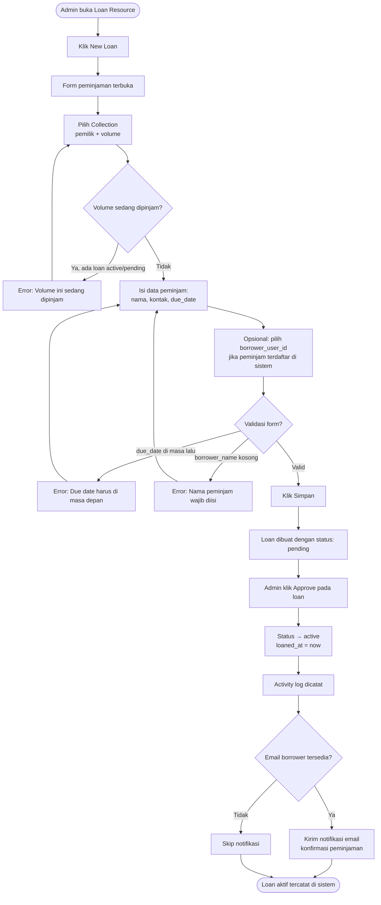
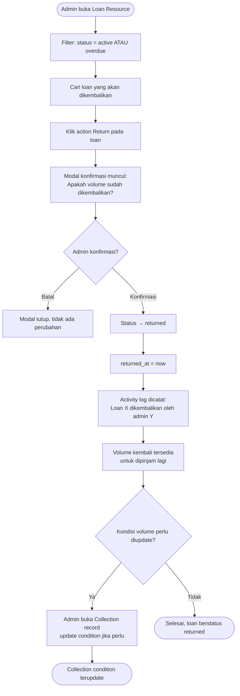
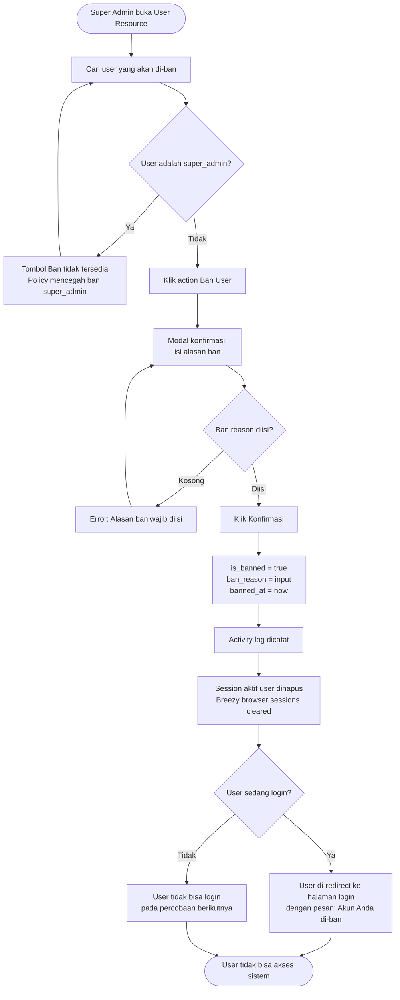
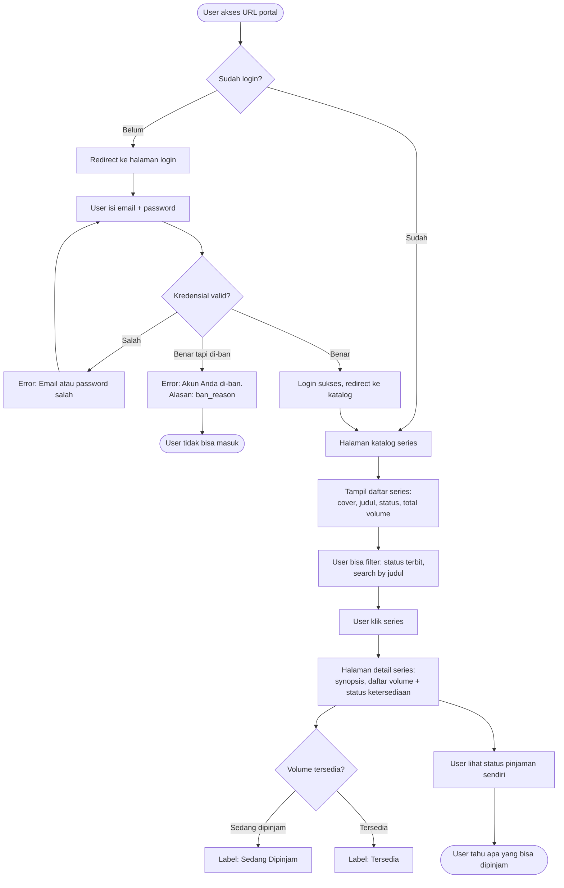
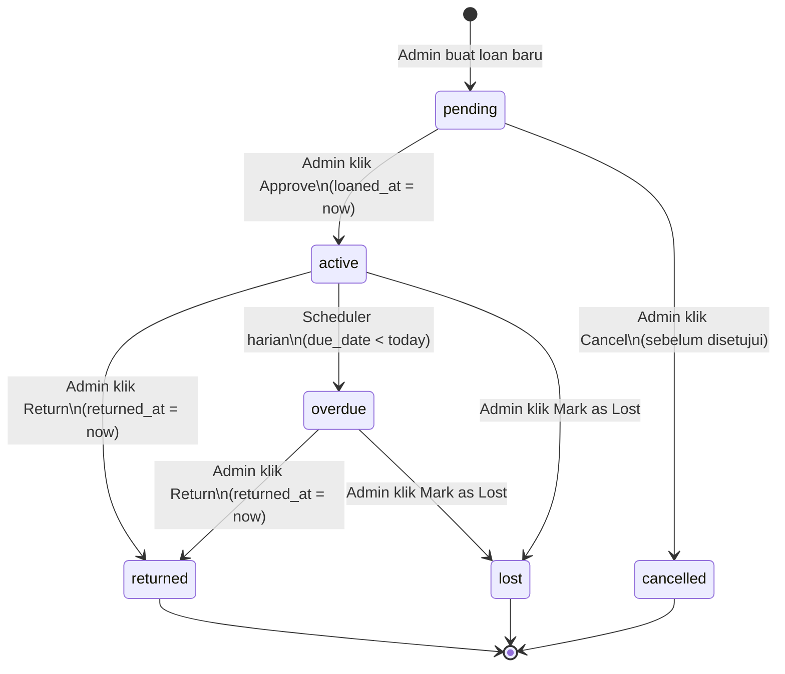
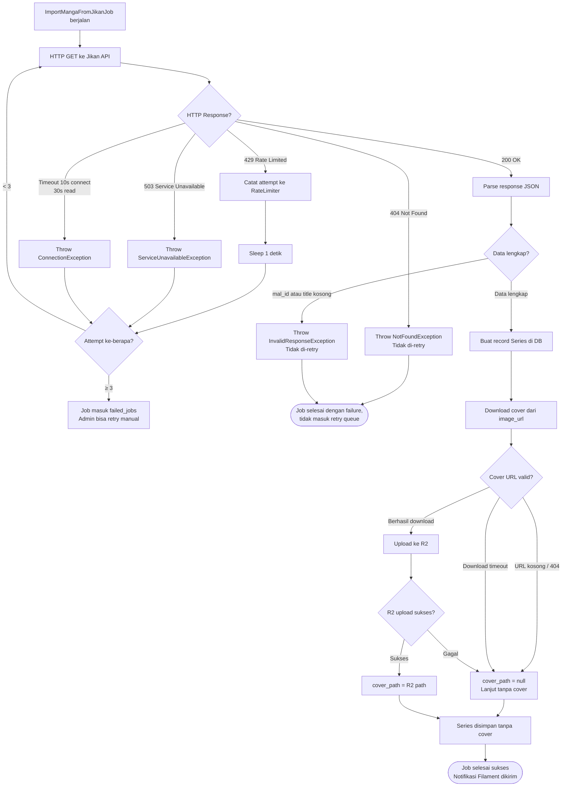

# User Flow — MALAS (Manga Library Admin System)

**Versi:** 1.0  
**Tanggal:** 2026-06-14

Semua flow menggunakan konvensi warna:
- **Hijau** (`:::success`) — happy path
- **Merah** (`:::error`) — error path  
- **Kuning** (`:::decision`) — decision point

---

## Flow 1: Admin — Onboarding Series Baru via Jikan

Skenario: admin ingin menambah series manga baru ke sistem menggunakan data dari MyAnimeList.

**Catatan:** Import berjalan di background queue. Admin tidak perlu menunggu — bisa lanjut kerja lain. Notifikasi muncul saat job selesai via Filament notification.

---

## Flow 2: Admin — Tambah Volume ke Series

Skenario: series sudah ada, admin ingin menambah data volume fisik yang dimiliki.

**Catatan:** Volume ditampilkan sebagai `RelationManager` di dalam `SeriesResource`. Form inline — tidak perlu buka halaman baru.

---

## Flow 3: Admin — Catat Peminjaman Baru

Skenario: ada teman yang mau pinjam volume dari koleksi admin.

---

## Flow 4: Admin — Proses Pengembalian

Skenario: peminjam mengembalikan volume, admin mencatat di sistem.

---

## Flow 5: Admin — Manajemen User (Ban)

Skenario: admin ingin memblokir akses user tertentu.

---

## Flow 6: User (Borrower) — Melihat Katalog

Skenario: teman peminjam ingin melihat koleksi apa yang tersedia.

---

## Flow 7: Loan Status Machine

State machine lengkap untuk status peminjaman.

**Aturan transisi:**
| Dari | Ke | Trigger | Actor |
|------|----|---------|-------|
| `pending` | `active` | Approve | Admin manual |
| `pending` | `cancelled` | Cancel | Admin manual |
| `active` | `returned` | Return | Admin manual |
| `active` | `overdue` | `MarkOverdueLoansCommand` | Scheduler (01:00 WIB) |
| `active` | `lost` | Mark as Lost | Admin manual |
| `overdue` | `returned` | Return | Admin manual |
| `overdue` | `lost` | Mark as Lost | Admin manual |

Transisi yang **tidak valid** akan ditolak oleh method `canTransitionTo()` di model `Loan`.

---

## Flow 8: Jikan Import Error Handling

Skenario-skenario error saat melakukan import dari Jikan API.

**Ringkasan penanganan error:**

| Error | Behavior | Retry? |
|-------|----------|--------|
| 429 Rate Limited | Sleep 1s, retry | Ya (max 3x) |
| 404 Not Found | Fail immediately | Tidak |
| 503 / Timeout | Retry dengan backoff | Ya (10s, 60s, 180s) |
| Data tidak lengkap | Fail immediately | Tidak |
| Cover URL invalid | Skip cover, lanjut | N/A |
| R2 upload gagal | Skip cover, lanjut | N/A |
| `mal_id` duplikat | Fail immediately | Tidak |
